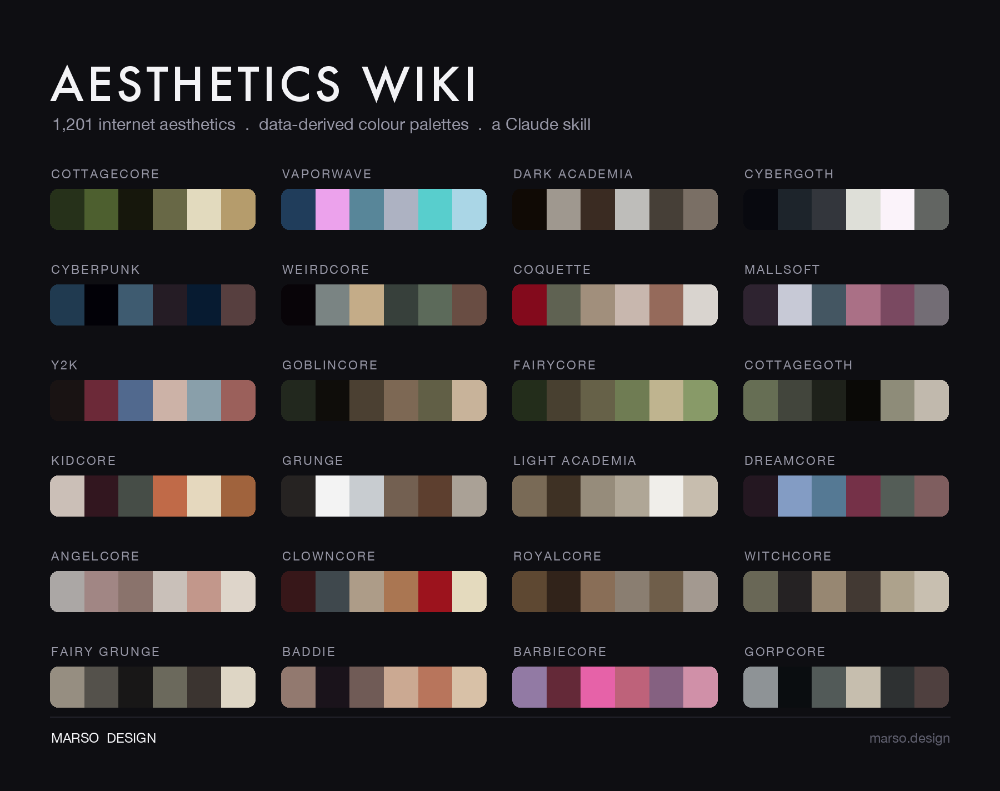
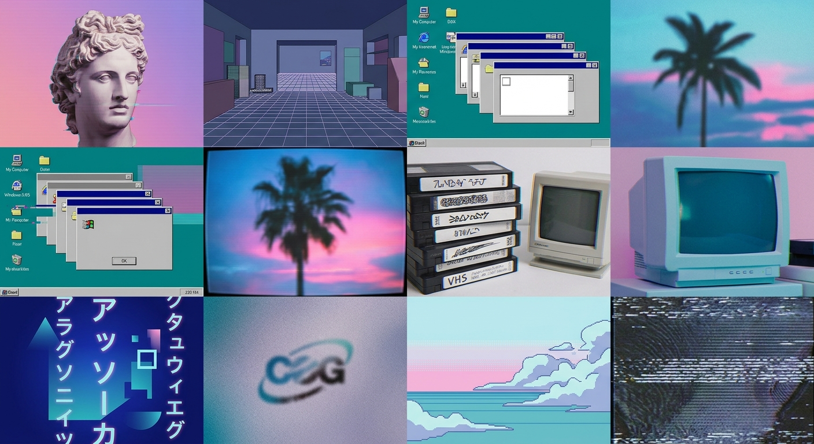
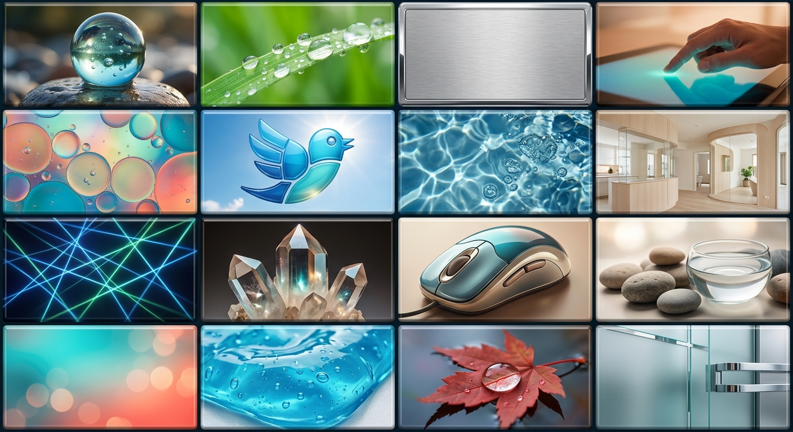
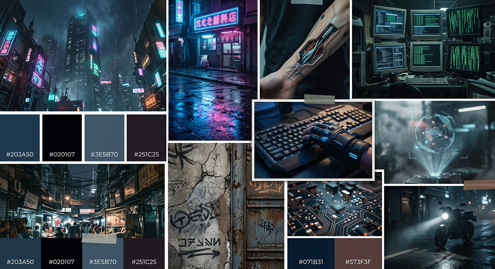
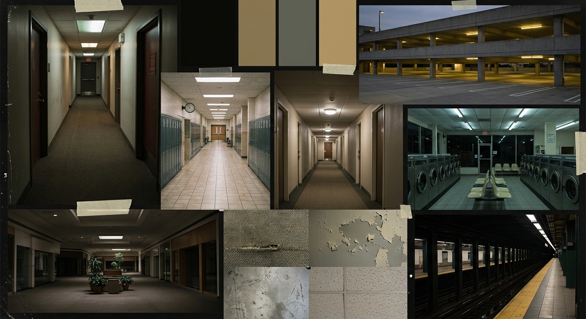
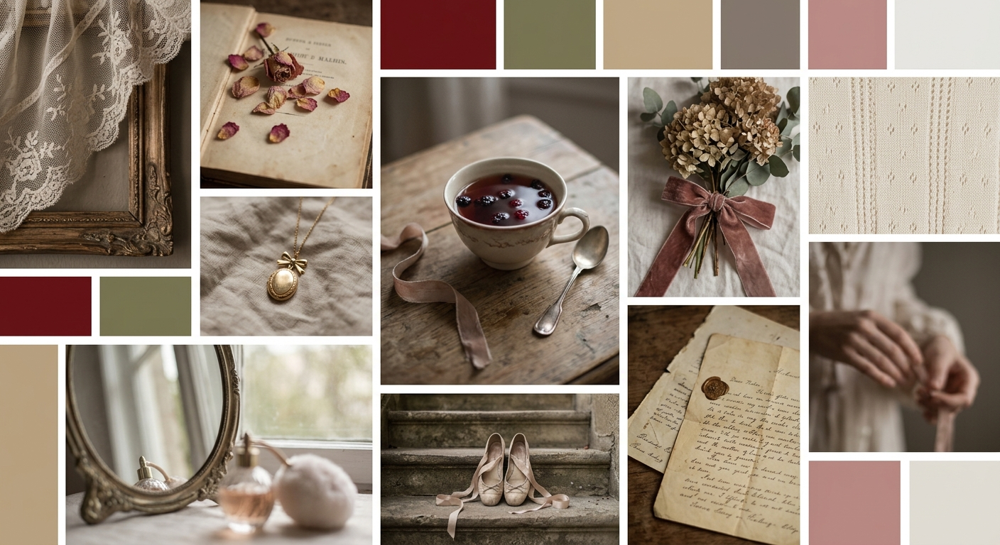
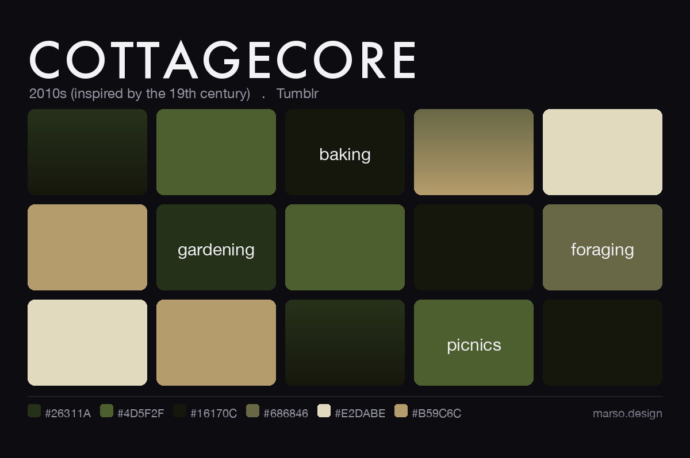
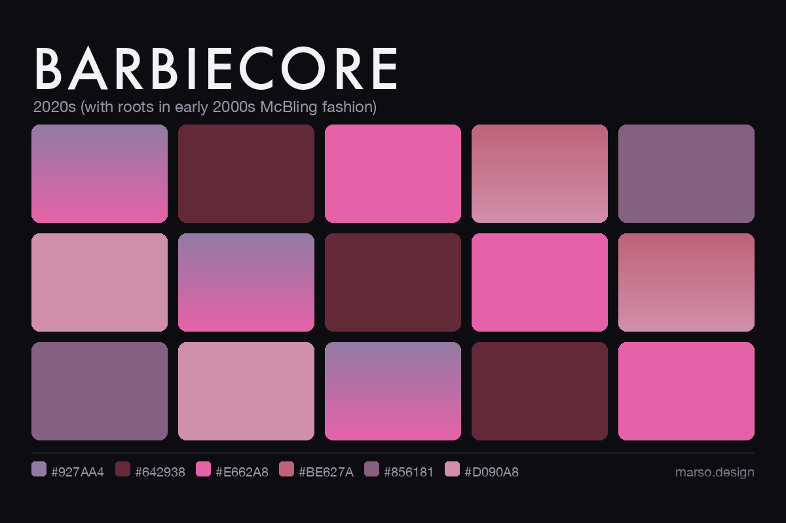

<div align="center">



# Aesthetics Wiki Skill

**A Claude skill that gives Claude a local, queryable knowledge base of 1,201 internet visual aesthetics.**

Cottagecore · Vaporwave · Dark Academia · Cybergoth · Weirdcore · Coquette · Mallsoft · and ~1,195 more.


</div>

---

Ask Claude to name a vibe, build a moodboard, compare two aesthetics, or theme an
outfit / room / brand / playlist / UI, and this skill backs the answer with real,
structured reference data instead of guesswork. Adapted from the
[Aesthetics Wiki](https://aesthetics.fandom.com/wiki/Aesthetics_Wiki) via the
MediaWiki API, cleaned into portable markdown, and indexed for fast lookup.

## What Claude can do with it

- **Name it** - identify an aesthetic from a vague description ("what's it called when...").
- **Explain it** - origin, motifs, colours, values, related aesthetics.
- **Search it** - by colour palette, decade, mood, or motif.
- **Connect it** - surface related and adjacent aesthetics.
- **Apply it** - turn an aesthetic into a moodboard, a real hex palette / design tokens, or a style direction for an outfit, room, brand, or site. The skill gives the direction; you build.
- **Blend it** - fuse two aesthetics into a coherent direction.

## Moodboards

Ask about any aesthetic and the skill builds a moodboard from its **own data** -
no scraped third-party photos. Two modes:

**Generated** - bring your own image API for rich, photo-based moodboards.
Examples below from Nano Banana 2 (Gemini 3.1 Flash Image):

<p align="center">






</p>

**Palette** - the free, no-key fallback, generated from the derived palette + motifs:

<p align="center">


</p>

```bash
python scripts/make_moodboard.py cottagecore     # free, no key (palette moodboard)
python scripts/gen_moodboard.py cottagecore      # photo moodboard (needs an image API)
```

### Bring your own image model

Point the skill at any image API and it builds the prompt from the aesthetic's
data (motifs, palette, mood), then generates the moodboard. No key = the palette
moodboard above is used instead.

```bash
cp .env.example .env      # add your key (git-ignored, never committed)
python scripts/gen_moodboard.py cottagecore --dry-run   # preview the prompt, no cost
python scripts/gen_moodboard.py cottagecore             # generate
```

Default is Gemini 3.1 Flash Image ("Nano Banana 2"); OpenAI-compatible models
work too via `IMAGE_PROVIDER` / `IMAGE_MODEL` / `IMAGE_API_BASE`.

## At a glance

| | |
|---|---|
| Aesthetics | **1,201** |
| With structured data (palettes / relations) | **1,125** |
| Data-derived hex palettes | from 13,464 reference images |
| Reference images catalogued | **13,464** |
| Text size | ~18 MB |
| Source | Aesthetics Wiki (CC-BY-SA 4.0) |

## Install

As a Claude Code **plugin**:

```bash
claude plugin marketplace add marso-design/aesthetics-wiki
claude plugin install aesthetics-wiki@marso-design
```

Or as a plain **skill** (clone into your skills directory):

```bash
git clone https://github.com/marso-design/aesthetics-wiki ~/.claude/skills/aesthetics-wiki
```

Either way it activates automatically when a request matches its description
(see the front matter in [`SKILL.md`](SKILL.md)). No manual step needed.

**Images are not shipped in the repo** (they are large and carry their own
licenses). The text, structured data, and per-image `credits.json` manifests are
all included. When Claude needs to *see* an aesthetic's images, it fetches just
those on demand:

```bash
python scripts/fetch_image.py cottagecore --limit 1   # or --all
```

> **Heads-up (Sept 2026):** Fandom now sits behind Cloudflare, which blocks
> scripted downloads, so `fetch_image.py` may return 403. When it does, it prints
> the wiki page link for each image so you can open it in a browser. The
> moodboards below are the reliable way to get visuals.

## Usage examples

```console
$ python scripts/lookup.py --find "empty shopping mall muzak" --limit 3
Mallsoft                     aesthetics/mallsoft.md
Kawaii                       aesthetics/kawaii.md
After Hours                  aesthetics/after-hours.md

$ python scripts/lookup.py --get mallsoft
Mallsoft                     aesthetics/mallsoft.md
  aka: Mallwave
  decade_of_origin: 2010s
  key_colours: Pink, teal, mint green, purple, white, gold
  key_motifs: Shopping malls, atrium architecture, food courts, indoor fountains, neon signage, consumerist decay
  related_aesthetics: After Hours, Liminal Space, Memphis Design, Vaporwave
  Mallsoft is a musical and visual subgenre of Vaporwave that emerged in the early 2010s...

$ python scripts/lookup.py --related Cottagecore --limit 4
Cozy Gamer                   aesthetics/cozy-gamer.md
Edwardian                    aesthetics/edwardian.md
Grandmacore                  aesthetics/grandmacore.md
Fairycore                    aesthetics/fairycore.md

$ python scripts/lookup.py --color pastel --limit 5
$ python scripts/lookup.py --decade 1990s
$ python scripts/lookup.py --get "dark academia"
```

Add `--json` for structured output, `--limit N` to widen results.

## What's in each entry

Every `aesthetics/<slug>.md` has structured front matter plus the full description:

```yaml
name: "Cottagecore"
aka: ["Farmcore", "Countrycore"]
decade_of_origin: "2010s (inspired by the 19th century)"
key_motifs: ["Baking", "gardening", "foraging", "picnics", "wildflowers", ...]
key_colours: ["Earthy and natural tones (brown, moss green, beige)", "soft pastels", ...]
palette: ["#26311A", "#4D5F2F", "#16170C", "#686846", "#E2DABE", "#B59C6C"]  # derived from images
key_values: ["Simplicity", "self-sufficiency", "harmony with nature", ...]
related_aesthetics: ["Fairycore", "Goblincore", "Grandmacore", ...]
subgenres: ["Bloomcore", "Cottagegoth", "Gardencore", ...]
primary_platform: ["Tumblr", "TikTok"]
source_url: "https://aesthetics.fandom.com/wiki/Cottagecore"
```

## How it works

- **Sourced via the MediaWiki API**, not HTML scraping. Polite by design
  (descriptive User-Agent, `maxlag`, retry-with-backoff) and resumable.
- **Infobox parsing** normalises each `{{Aesthetic}}` template into typed front matter.
- **Progressive disclosure**: the skill queries a compact index and reads one
  entry at a time, so it stays fast at 1,200+ pages instead of loading everything.

## Repository layout

```
SKILL.md               # skill definition + the lookup protocol Claude follows
aesthetics/<slug>.md   # 1,201 entries: structured front matter + full text
images/<slug>/         # credits.json manifests (binaries fetched on demand)
data/index.json        # compact search index
scripts/scrape.py      # pull everything from the wiki (resumable)
scripts/build_index.py # rebuild data/index.json from the files
scripts/lookup.py      # query CLI (resolve, search, related, by colour/decade/motif)
scripts/fetch_image.py # fetch an aesthetic's images on demand for local viewing
scripts/palette.py     # derive hex palettes from reference images
scripts/make_showcase.py # render the palette-wall hero (--social: link preview card)
scripts/make_moodboard.py # render a per-aesthetic moodboard from data/palettes.json
```

## Regenerate from source

The data in this repo is a snapshot taken on **2026-07-22** (1,201 aesthetics).
Fandom's Cloudflare currently blocks scripted API access, so `scrape.py` exits
with a clear message instead of refreshing. The pipeline is kept for when access
is available again.

```bash
python -m venv .venv && source .venv/bin/activate
pip install -r requirements.txt

python scripts/scrape.py            # full pull (text + images), resumable
python scripts/build_index.py       # rebuild the search index
python scripts/lookup.py --stats    # sanity check
```

## Licensing

- **Code** (`scripts/`, `SKILL.md`): MIT. See [`LICENSE`](LICENSE).
- **Text** (`aesthetics/`): CC-BY-SA 4.0, from the Aesthetics Wiki. Attribute and
  share-alike. See [`LICENSE-CONTENT.md`](LICENSE-CONTENT.md) and [`ATTRIBUTION.md`](ATTRIBUTION.md).
- **Images**: each carries its own, often unspecified, license. They are excluded
  from this repo by default; only the `credits.json` manifests are tracked. Verify
  a given image's license before republishing it.

Not affiliated with, endorsed by, or sponsored by the Aesthetics Wiki or Fandom, Inc.

---

<div align="center">

Built by **[Marso Design](https://marso.design)** - brand, site, and product UI, shipped.

</div>
